# 📐 Pipeline Architecture - Pseudo-LiDAR

Este diagrama mostra a arquitetura completa do pipeline Pseudo-LiDAR.

## 🏗️ Arquitetura Geral

```mermaid
graph TB
    A[📹 Input Source] --> B[🎬 Video Capture]
    B --> C[🖼️ Frame Processing]
    
    C --> D[🔍 Depth Estimation]
    D --> E[📊 DPT/MiDaS Model]
    E --> F[🗺️ Depth Map]
    
    F --> G[🎯 3D Projection]
    G --> H[📐 Camera Matrix]
    H --> I[☁️ Point Cloud 3D]
    
    I --> J[🗺️ BEV Generation]
    J --> K[🎨 BEV Image]
    
    K --> L{🤖 YOLO Detection?}
    L -->|Yes| M[📦 Object Detection]
    L -->|No| N[🎨 Enhanced BEV]
    M --> N
    
    N --> O[📺 Side-by-Side View]
    O --> P[🌐 FFmpeg Streaming]
    P --> Q[📡 RTMP Server]
    
    style A fill:#e1f5fe
    style Q fill:#e8f5e8
    style E fill:#fff3e0
    style K fill:#fce4ec
```

## 🔄 Componentes Principais

### 1. **Input Layer**
- **Video Source**: Webcam, arquivo, ou stream RTMP
- **Frame Capture**: OpenCV VideoCapture
- **Preprocessing**: Redimensionamento para 640x480

### 2. **Depth Estimation**
- **Models**: DPT_Large, DPT_Hybrid, MiDaS, MiDaS_small
- **Backend**: PyTorch + Transformers/MiDaS
- **Output**: Depth map [H, W] em metros

### 3. **3D Processing**
- **Camera Projection**: Pixel coordinates → 3D points
- **Transformation**: Camera frame → Ground plane
- **Filtering**: Remove invalid/outlier points

### 4. **BEV Generation**
- **Projection**: 3D points → Bird's Eye View
- **Rendering**: Height-based intensity mapping
- **Enhancement**: Gaussian blur, dilation, colormap

### 5. **Detection (Optional)**
- **Model**: YOLOv8 on BEV image
- **Classes**: person, car, bicycle, motorcycle, bus, truck
- **Visualization**: Bounding boxes + confidence

### 6. **Streaming**
- **Composition**: Original | Depth | BEV (1920x480)
- **Encoding**: H.264 with FFmpeg
- **Protocol**: RTMP to SRS server
- **URL**: `rtmp://195.200.0.55:1935/live/bev_processed`

## ⚙️ Configuration Flow

## 🎯 Key Features

- **Modular Design**: Each component is independent and testable
- **Configurable**: All parameters centralized in config.py
- **Scalable**: Support for multiple depth models and resolutions
- **Integrated**: Reuses YOLO project infrastructure
- **Robust**: Error handling and fallback mechanisms

## 📊 Performance Characteristics

| Component | GPU Memory | CPU Usage | Latency |
|-----------|------------|-----------|---------|
| DPT_Large | 1-2 GB | High | 80-100ms |
| MiDaS | 500MB-1GB | Medium | 40-60ms |
| BEV Generation | <100MB | Low | 5-10ms |
| YOLO Detection | 200-500MB | Medium | 10-20ms |
| Streaming | <50MB | Low | 5-15ms |

## 🔗 Integration Points

- **Shared Server**: Same SRS instance as YOLO project
- **Compatible Input**: Same RTMP stream source
- **Differentiated Output**: Separate BEV stream endpoint
- **Code Reuse**: Adapted utilities and configurations 